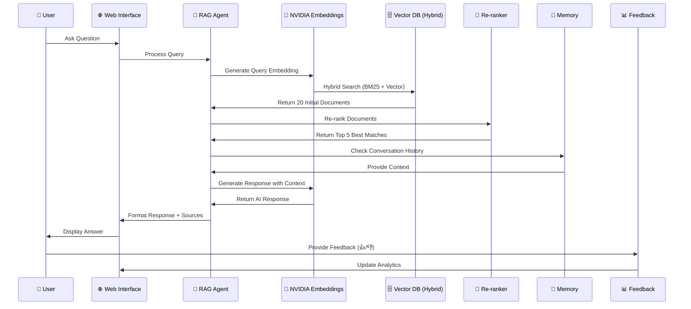
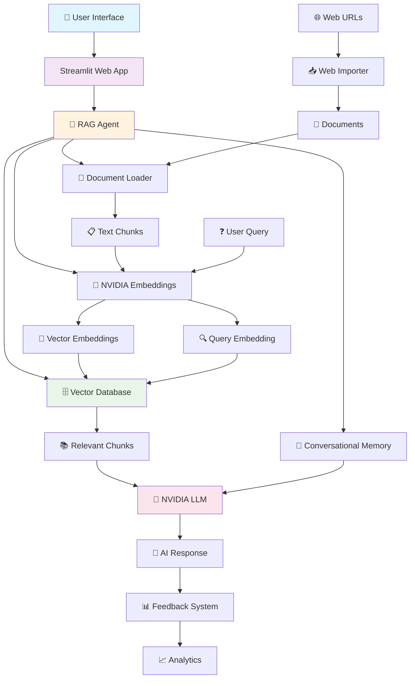

# 🚀 InsightEngine RAG - NVIDIA Powered AI Document Assistant

[](https://python.org)
[](https://streamlit.io)
[](https://build.nvidia.com)
[](LICENSE)

An enterprise-ready RAG (Retrieval-Augmented Generation) system powered by NVIDIA's cutting-edge AI models. Transform your documents into an intelligent Q&A assistant with advanced hybrid search, conversational memory, and real-time analytics.

## ✨ Key Features

### 🎯 Advanced AI Capabilities

- **NVIDIA AI Models**: `nvidia/nv-embed-v1` embeddings + `meta/llama-3.1-8b-instruct` LLM.
- **Hybrid Search**: BM25 keyword matching (30%) + Vector similarity (70%) for optimal accuracy.
- **Smart Re-ranking**: Cross-encoder models boost document relevance by up to 40%.
- **Multi-format Support**: Processes PDF, DOCX, PPTX, and TXT files with intelligent chunking.
- **Conversational Memory**: Provides context-aware responses with a configurable memory window.

### 💼 Production Ready

- **Beautiful Web Interface**: A modern Streamlit UI with real-time chat.
- **Auto File Monitoring**: Automatically updates when documents change.
- **Feedback Analytics**: Tracks user satisfaction and system performance.
- **Health Monitoring**: Comprehensive system diagnostics and optimization.
- **Scalable Architecture**: Features a modular design for easy customization and deployment.
- **Source Attribution**: Detailed document references with page numbers and excerpts.
- **Visual Analytics**: Includes interactive charts, document statistics, and coverage analysis.
- **Web Import**: Allows downloading documents directly from web URLs.

### **📊 Enhanced Data Flow Architecture with Re-ranking**



## 🏗️ System Architecture



## 📋 Prerequisites

### System Requirements

- **Python**: 3.8+ (3.9+ recommended)
- **RAM**: 4GB minimum, 8GB+ recommended
- **Storage**: 2GB free space
- **OS**: Windows 10, macOS 10.14, Ubuntu 18.04+
- **Network**: Stable internet connection for NVIDIA API access.

### Required Accounts

1.  **NVIDIA Developer Account**: Get your free API key at [build.nvidia.com](https://build.nvidia.com).
2.  **Git**: For cloning the repository.

## 🚀 Quick Start

### 1. Clone & Setup Environment

```bash
# Clone repository
git clone https://github.com/debnathkundu/InsightEngine-RAG-NVIDIA.git
cd RAG-Template-for-NVIDIA-nemoretriever

# Create and activate virtual environment
python -m venv rag_env
# On Windows:
# rag_env\Scripts\activate
# On macOS/Linux:
source rag_env/bin/activate
```

### 2. Install Dependencies

```bash
# Install Python packages
pip install -r requirements.txt

# Install system dependencies for libmagic
# On macOS:
brew install libmagic
# On Ubuntu/Debian:
sudo apt-get install libmagic1
```

### 3. Configure API Key

Create a `.env` file from the template and add your NVIDIA API key.

```bash
cp .env.template .env
# Now edit the .env file and add your key
# NANO_API_KEY=nvapi-your-actual-api-key-here
```

### 4. Add Your Documents

Place your PDF, DOCX, PPTX, or TXT files into the `Data/Docs` directory.

### 5. Launch the Application

You can launch the application in three ways:

```bash
# Option A: Web Interface (Recommended)
python start_web_interface.py

# Option B: Command Line Interface
python main.py

# Option C: Direct Streamlit
streamlit run streamlit_app.py
```

The web interface will be available at `http://localhost:8501`.

## 🔧 Configuration

Configuration is managed via environment variables in the `.env` file.

| Variable         | Description                        | Default                                  |
| ---------------- | ---------------------------------- | ---------------------------------------- |
| `NVIDIA_API_KEY` | Your NVIDIA API key                | **Required**                             |
| `DOCS_FOLDER`    | Path to your documents             | `Data/Docs`                              |
| `VECTOR_DB_PATH` | Path to the vector database        | `./vector_db`                            |
| `CHUNK_SIZE`     | Document chunk size                | `1000`                                   |
| `CHUNK_OVERLAP`  | Overlap between chunks             | `200`                                    |
| `RERANKER_MODEL` | Cross-encoder model for re-ranking | `cross-encoder/ms-marco-TinyBERT-L-2-v2` |

## 📁 Project Structure

```
RAG-Template-for-NVIDIA-nemoretriever/
├── src/                          # Core system modules
│   ├── rag_agent.py             # Main RAG orchestrator
│   ├── vector_database.py       # FAISS + hybrid search
│   ├── document_loader.py       # Multi-format document processing
│   ├── nvidia_embeddings.py     # NVIDIA API integration
│   ├── document_reranker.py     # Cross-encoder re-ranking
│   ├── file_watcher.py          # Auto-update system
│   └── web_importer.py          # URL-based document import
├── Data/Docs/                   # Place your documents here
├── streamlit_app.py             # Web interface
├── main.py                      # CLI interface
├── start_web_interface.py       # Quick launcher
├── requirements.txt             # Python dependencies
├── .env.template               # Configuration template
└── README.md                   # This file
```

## 🤝 Contributing

Contributions are welcome! Please follow these steps:

1.  Fork the repository.
2.  Create a new feature branch (`git checkout -b feature/amazing-feature`).
3.  Commit your changes (`git commit -m 'Add amazing feature'`).
4.  Push to the branch (`git push origin feature/amazing-feature`).
5.  Open a Pull Request.

## 📄 License

This project is licensed under the MIT License. See the [LICENSE](LICENSE) file for details.

## 🙏 Acknowledgments

- **NVIDIA**: For providing state-of-the-art AI models.
- **LangChain**: For the robust RAG framework.
- **Streamlit**: For the beautiful web interface.
- **FAISS**: For efficient vector similarity search.
- **Sentence Transformers**: For document re-ranking capabilities.
